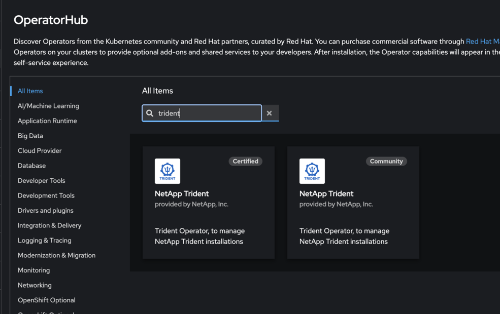

= TridentコミュニティオペレーターからOpenShift認定オペレーターへ切り替える
:hardbreaks:
:allow-uri-read: 
:icons: font
:imagesdir: ../media/

[role="lead"]
NetApp Community Trident OperatorからRed Hat OpenShift Certified Trident Operatorに切り替えるには、コミュニティオペレーターをアンインストールしてから、OperatorHubを使用して認定オペレーターをインストールする必要があります。

.開始する前に
インストールを始める前に、link:../trident-get-started/requirements.html["Tridentインストールのための環境を準備する"]。

== NetApp Tridentコミュニティオペレーターをアンインストールします

.手順
. OpenShiftコンソールを使用してOperatorHubに移動します。
+

. NetApp Tridentコミュニティオペレーターを見つけます。
+
image::../media/openshift-operator-06.png[インストール済み]

+

WARNING: *この演算子からすべてのオペランドインスタンスを削除する*を選択しないでください。

. *Uninstall* をクリックします。

== OpenShift認定オペレーターをインストールします

.手順
. Red Hat OperatorHubに移動します。
. NetApp Trident Operatorを検索して選択します。
+

. 画面上の指示に従ってオペレーターをインストールします。

== 検証

* コンソールのOperatorHubを確認して、新しい認定オペレータが正常にインストールされたことを確認します。

