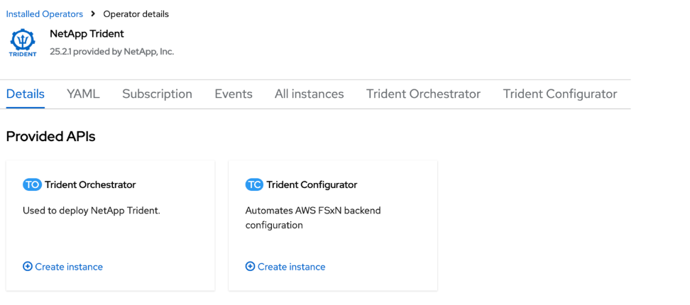

= OpenShift OperatorHubを使用してTridentをインストールする
:hardbreaks:
:allow-uri-read: 
:icons: font
:imagesdir: ../media/

[role="lead"]
Red Hat OpenShiftを使用している場合は、Red Hat認定オペレーターを使用してNetApp Tridentをインストールできます。この手順を使用して、Red Hat OpenShift Container PlatformからTridentをインストールします。

.開始する前に
インストールを始める前に、link:../trident-get-started/requirements.html["Tridentインストールのための環境を準備する"]。

== Tridentオペレーターを検索してインストールする

.手順
. OpenShift OperatorHubに移動し、NetApp Tridentを検索します。
+
image::../media/openshift-operator-01.png[Trident Operator]

. *NetApp Trident* をクリックして、インストール設定を開きます。
. 必要なオプションを選択し、*Install* をクリックしてOperator構成を開きます。
+
image::../media/openshift-operator-02.png[インストール]

+

NOTE: 必ず最新の Operator バージョンを選択してください。

. すべてのパラメータをそのままにして、*Install* をクリックします。
+
image::../media/openshift-operator-03.png[インストール]

+
インストールが完了すると、Operatorがインストール済みオペレーターのリストに表示され、使用できるようになります。

. *View Operator*をクリックして、Operatorの詳細を表示します。
+
image::../media/openshift-operator-04.png[インストール済み]

. *Trident Orchestrator* で、 *Create instance* をクリックします。
+

. *YAML view* をクリックし、次の内容をフォームに貼り付けます：
+
[source, yaml]
----
apiVersion: trident.netapp.io/v1
kind: TridentOrchestrator
metadata:
  name: trident
  namespace: openshift-operators
spec:
  IPv6: false
  debug: false
  nodePrep:
  - iscsi
  imageRegistry: ''
  k8sTimeout: 30
  namespace: trident
  silenceAutosupport: false
----
+
[]
====
** Red Hat Enterprise Linux CoreOS（RHCOS）では iSCSI が有効化および構成されていません。
**  `nodePrep`パラメータを追加して、すべてのOpenShiftワーカーノードでiSCSIおよびマルチパスサービスを設定および有効にすることができます。
** OpenShift 4.19 以降、この機能でサポートされる Trident の最小バージョンは 25.06.1 です。

====
. *作成*をクリックします。Trident Orchestrator が完全にインストールされます。
+
image::../media/openshift-operator-08.png[インストール済み]

== Tridentオペレーターをアンインストールします

.手順
. インストールされているオペレータのリストから Trident オペレータを選択します。
. 演算子からすべてのオペランドインスタンスを削除する場合に選択します。
+

WARNING: *この演算子からすべてのオペランドインスタンスを削除する*チェックボックスを選択しない場合、Tridentはアンインストールされません。

. *Uninstall* をクリックします。

