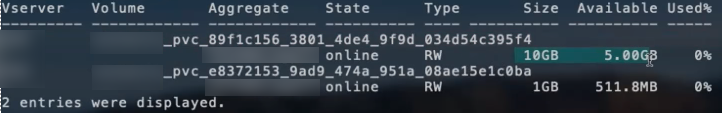

= ONTAP NAS 構成オプションと例
:hardbreaks:
:allow-uri-read: 
:icons: font
:imagesdir: ../media/

[role="lead"]
Tridentインストールで使用するONTAP NASドライバーの作成方法と使用方法について説明します。このセクションでは、バックエンドの設定例と、バックエンドをStorageClassesにマッピングするための詳細について説明します。

25.10リリース以降、NetApp Tridentはlink:https://docs.netapp.com/us-en/ontap-afx/index.html["NetApp AFX ストレージ システム"^]をサポートします。NetApp AFXストレージシステムは、ストレージ レイヤの実装において、他のONTAPベースのシステム（ASA、AFF、FAS）とは異なります。

NOTE:  `ontap-nas`ドライバー（NFSプロトコル付き）のみがNetApp AFXシステムでサポートされています。SMBプロトコルはサポートされていません。

Trident バックエンド設定では、システムがNetApp AFX ストレージ システムであることを指定する必要はありません。 `ontap-nas`を `storageDriverName`として選択すると、Trident は AFX ストレージ システムを自動的に検出します。以下の表に示すように、一部のバックエンド構成パラメータは AFX ストレージ システムには適用されません。

== バックエンド構成オプション

バックエンド構成オプションについては、次の表を参照してください：

[cols="1,3,2"]
|===
| パラメータ | 概要 | デフォルト 

| `version` |  | 常に1 

| `storageDriverName`  a| 
ストレージドライバーの名前

NOTE: NetApp AFXシステムでは、 `ontap-nas`のみがサポートされます。
| `ontap-nas`、 `ontap-nas-economy`、または `ontap-nas-flexgroup` 

| `backendName` | カスタム名またはストレージバックエンド | ドライバー名 + "_" + dataLIF 

| `managementLIF` | クラスタまたは SVM 管理 LIF の IP アドレス。完全修飾ドメイン名（FQDN）を指定できます。Trident が IPv6 フラグを使用してインストールされた場合、IPv6 アドレスを使用するように設定できます。IPv6 アドレスは角括弧で囲んで定義する必要があります。例： `[28e8:d9fb:a825:b7bf:69a8:d02f:9e7b:3555]`。シームレスな MetroCluster スイッチオーバーについては、<<mcc-best>>を参照してください。 | "10.0.0.1"、"[2001:1234:abcd::fefe]" 

| `dataLIF` | プロトコル LIF の IP アドレス。NetApp では `dataLIF`を指定することを推奨します。指定しない場合、Trident は SVM から dataLIF を取得します。NFS マウント操作に使用する完全修飾ドメイン名（FQDN）を指定できます。これにより、複数の dataLIF 間で負荷を分散するラウンドロビン DNS を作成できます。初期設定後に変更できます。を参照してください。Trident が IPv6 フラグを使用してインストールされた場合、IPv6 アドレスを使用するように設定できます。IPv6 アドレスは、 `[28e8:d9fb:a825:b7bf:69a8:d02f:9e7b:3555]`のように角括弧で定義する必要があります。*MetroCluster の場合は省略します。*<<mcc-best>>を参照してください。 | 指定されたアドレス、または指定されていない場合は SVM から導出されます（非推奨） 

| `svm` | 使用するストレージ仮想マシン *MetroCluster の場合は省略。*<<mcc-best>>を参照してください。 | SVM `managementLIF`が指定されている場合に導出されます 

| `autoExportPolicy` | 自動エクスポート ポリシーの作成と更新を有効にします [ブール値]。 `autoExportPolicy`および `autoExportCIDRs`オプションを使用すると、Tridentはエクスポート ポリシーを自動的に管理できます。 | false 

| `autoExportCIDRs` |  `autoExportPolicy`が有効になっている場合にKubernetesのノードIPをフィルタリングするためのCIDRのリスト。 `autoExportPolicy`および `autoExportCIDRs`オプションを使用すると、Tridentはエクスポート ポリシーを自動的に管理できます。 | ["0.0.0.0/0", "::/0"]` 

| `labels` | ボリュームに適用する任意の JSON 形式のラベルのセット | "" 

| `clientCertificate` | クライアント証明書の Base64 エンコードされた値。証明書ベースの認証に使用 | "" 

| `clientPrivateKey` | クライアント秘密キーの Base64 エンコードされた値。証明書ベースの認証に使用 | "" 

| `trustedCACertificate` | 信頼された CA 証明書の Base64 エンコードされた値。オプション。証明書ベースの認証に使用 | "" 

| `username` | クラスタ/SVM に接続するためのユーザー名。資格情報ベースの認証に使用されます。Active Directory 認証については、link:../trident-use/ontap-san-examples.html#authenticate-trident-to-a-backend-svm-using-active-directory-credentials["Active Directory の認証情報を使用してバックエンド SVM に Trident を認証"]を参照してください。 |  

| `password` | クラスター/SVM に接続するためのパスワード。クレデンシャルベースの認証に使用されます。Active Directory 認証については、link:../trident-use/ontap-san-examples.html#authenticate-trident-to-a-backend-svm-using-active-directory-credentials["Active Directory の認証情報を使用してバックエンド SVM に Trident を認証"]を参照してください。 |  

| `storagePrefix`  a| 
SVM で新しいボリュームをプロビジョニングするときに使用されるプレフィックス。設定後は更新できません

NOTE: ontap-nas-economy と 24 文字以上の storagePrefix を使用する場合、ボリューム名にはストレージ プレフィックスが含まれますが、qtree にはストレージ プレフィックスが埋め込まれません。
| 「trident」 

| `aggregate`  a| 
プロビジョニング用のアグリゲート（オプション。設定する場合は、SVM に割り当てる必要があります）。 `ontap-nas-flexgroup`ドライバーの場合、このオプションは無視されます。割り当てられていない場合は、利用可能なアグリゲートのいずれかを使用してFlexGroupボリュームをプロビジョニングできます。

NOTE: SVM でアグリゲートが更新されると、Trident Controller を再起動することなく、SVM をポーリングすることで Trident で自動的に更新されます。ボリュームをプロビジョニングするために Trident で特定のアグリゲートを設定している場合、そのアグリゲートの名前が変更されたり SVM から移動されたりすると、SVM アグリゲートのポーリング中にバックエンドが Trident で障害状態に移行します。バックエンドをオンラインに戻すには、アグリゲートを SVM 上に存在するものに変更するか、完全に削除する必要があります。

*AFX ストレージ システムには指定しないでください。*
 a| 
""

| `limitAggregateUsage` | 使用率がこのパーセンテージを超える場合、プロビジョニングは失敗します。*Amazon FSx for ONTAPには適用されません*。*AFXストレージシステムには指定しないでください。* | ""（デフォルトでは強制されません） 

| flexgroupAggregateList  a| 
プロビジョニング用のアグリゲートのリスト（オプション。設定する場合は、SVMに割り当てる必要があります）。SVMに割り当てられたすべてのアグリゲートは、FlexGroupボリュームのプロビジョニングに使用されます。*ontap-nas-flexgroup*ストレージドライバーでサポートされています。

NOTE: SVMでアグリゲートリストが更新されると、Trident ControllerをTridentせずにSVMをポーリングすることで、リストはTridentで自動的に更新されます。Tridentでボリュームをプロビジョニングするために特定のアグリゲートリストを設定している場合、アグリゲートリストの名前が変更されたり、SVMから移動されたりすると、SVMアグリゲートのポーリング中にバックエンドがTridentで障害状態に移行します。バックエンドをオンラインに戻すには、アグリゲートリストをSVM上に存在するリストに変更するか、完全に削除する必要があります。
| "" 

| `limitVolumeSize` | 要求されたボリューム サイズがこの値を超える場合、プロビジョニングは失敗します。 | ""（デフォルトでは強制されません） 

| `debugTraceFlags` | トラブルシューティング時に使用するデバッグ フラグ。例：{"api":false, "method":true}  `debugTraceFlags`を使用しないでください。ただし、トラブルシューティングを行っており、詳細なログ ダンプが必要な場合を除きます。 | null 

| `nasType` | NFSまたはSMBボリュームの作成を設定します。オプションは `nfs`、 `smb`、またはnullです。nullに設定すると、デフォルトでNFSボリュームになります。*指定されている場合は、AFXストレージシステムの場合は常に `nfs`に設定してください*。 | `nfs` 

| `nfsMountOptions` | NFS マウント オプションのコンマ区切りリスト。Kubernetes 永続ボリュームのマウント オプションは通常ストレージ クラスで指定されますが、ストレージ クラスでマウント オプションが指定されていない場合、Trident はストレージ バックエンドの構成ファイルで指定されたマウント オプションを使用するようになります。ストレージ クラスまたは構成ファイルにマウント オプションが指定されていない場合、Trident は関連付けられている永続ボリュームにマウント オプションを設定しません。 | "" 

| `qtreesPerFlexvol` | FlexVol あたりの最大 Qtree 数は、範囲 [50, 300] 内である必要があります | "200" 

| `smbShare` | 次のいずれかを指定できます：Microsoft Management ConsoleまたはONTAP CLIを使用して作成されたSMB共有の名前、TridentがSMB共有を作成できるようにする名前、またはパラメータを空白のままにしてボリュームへの共通共有アクセスを防止できます。このパラメータは、オンプレミスONTAPではオプションです。このパラメータは、Amazon FSx for ONTAPバックエンドでは必須であり、空白にすることはできません。 | `smb-share` 

| `useREST` | ONTAP REST APIを使用するブーリアン パラメータ。 `useREST`に設定すると `true`、TridentはONTAP REST APIを使用してバックエンドと通信します。 `false`に設定すると、TridentはONTAPI（ZAPI）呼び出しを使用してバックエンドと通信します。この機能にはONTAP 9.11.1以降が必要です。さらに、使用するONTAPログインロールには、 `ontapi`アプリケーションへのアクセス権が必要です。これは、事前定義された `vsadmin`および `cluster-admin`ロールで満たされます。Trident 24.06リリースおよびONTAP 9.15.1以降では、 `useREST`はデフォルトで `true`に設定されます。ONTAPI（ZAPI）呼び出しを使用するには、 `useREST`を `false`に変更してください。*指定する場合は、AFXストレージシステムでは常に `true`に設定してください*。 | ONTAP 9.15.1以降の場合は`true`、それ以外の場合は `false`。 

| `limitVolumePoolSize` | ontap-nas-economy バックエンドで Qtree を使用する場合の最大リクエスト可能 FlexVol サイズ。 | ""（デフォルトでは強制されません） 

| `denyNewVolumePools` | バックエンドが Qtree を格納する新しい FlexVol ボリュームを作成できないように制限 `ontap-nas-economy`します。新しい PV のプロビジョニングには、既存の FlexVol のみが使用されます。 |  

| `adAdminUser` | SMB 共有へのフルアクセス権を持つ Active Directory 管理者ユーザーまたはユーザー グループ。このパラメータを使用して、SMB 共有へのフルコントロールの管理者権限を付与します。 |  
|===

== ボリュームのプロビジョニング用のバックエンド設定オプション

デフォルトのプロビジョニングは、設定の `defaults`セクションにあるこれらのオプションを使用して制御できます。例については、以下の設定例を参照してください。

[cols="1,3,2"]
|===
| パラメータ | 概要 | デフォルト 

| `spaceAllocation` | Qtreeのスペース割り当て | "true" 

| `spaceReserve` | スペース予約モード：「none」（シン）または「volume」（シック） | 「なし」 

| `snapshotPolicy` | 使用するSnapshotポリシー | 「なし」 

| `qosPolicy` | 作成されたボリュームに割り当てる QoS ポリシー グループ。ストレージプール / バックエンドごとにqosPolicyまたはadaptiveQosPolicyのいずれかを選択してください | "" 

| `adaptiveQosPolicy` | 作成されたボリュームに割り当てるアダプティブ QoS ポリシー グループ。ストレージ プール/バックエンドごとにqosPolicyまたはadaptiveQosPolicyのいずれかを選択してください。ontap-nas-economy ではサポートされていません。 | "" 

| `snapshotReserve` | Snapshot 用に予約されているボリュームの割合 |  `snapshotPolicy`が「none」の場合は「0」、それ以外の場合は「」 

| `splitOnClone` | 作成時にクローンを親から分離する | "false" 

| `encryption` | 新しいボリュームでNetApp Volume Encryption（NVE）を有効にします。デフォルトは `false`です。このオプションを使用するには、NVEのライセンスを取得し、クラスタで有効にする必要があります。バックエンドでNAEが有効になっている場合、TridentでプロビジョニングされたボリュームはすべてNAEが有効になります。詳細については、次を参照してください：link:../trident-reco/security-reco.html["Tridentと NVE および NAE の連携"]。 | "false" 

| `tieringPolicy` | 階層化ポリシーで「none」を使用 |  

| `unixPermissions` | 新しいボリュームのモード | NFS ボリュームの場合は「777」、SMB ボリュームの場合は空（該当なし） 

| `snapshotDir` |  `.snapshot`ディレクトリへのアクセスを制御します | NFSv4の場合は"true"、NFSv3の場合は"false" 

| `exportPolicy` | 使用するエクスポートポリシー | "default" 

| `securityStyle` | 新しいボリュームのセキュリティ スタイル。NFSは `mixed`および `unix`セキュリティ スタイルをサポートします。SMBは `mixed`および `ntfs`セキュリティ スタイルをサポートします。 | NFSのデフォルトは `unix`です。SMBのデフォルトは `ntfs`です。 

| `nameTemplate` | カスタムボリューム名を作成するためのテンプレート。 | "" 
|===

NOTE: Trident で QoS ポリシーグループを使用するには、ONTAP 9.8 以降が必要です。共有されていない QoS ポリシーグループを使用し、ポリシーグループが各構成要素に個別に適用されるようにする必要があります。共有 QoS ポリシーグループは、すべてのワークロードの合計スループットの上限を適用します。

=== ボリュームプロビジョニングの例

デフォルトを定義した例を次に示します：

[source, yaml]
----
---
version: 1
storageDriverName: ontap-nas
backendName: customBackendName
managementLIF: 10.0.0.1
dataLIF: 10.0.0.2
labels:
  k8scluster: dev1
  backend: dev1-nasbackend
svm: trident_svm
username: cluster-admin
password: <password>
limitAggregateUsage: 80%
limitVolumeSize: 50Gi
nfsMountOptions: nfsvers=4
debugTraceFlags:
  api: false
  method: true
defaults:
  spaceReserve: volume
  qosPolicy: premium
  exportPolicy: myk8scluster
  snapshotPolicy: default
  snapshotReserve: "10"
----
 `ontap-nas`および `ontap-nas-flexgroups`の場合、Tridentは新しい計算方法を使用して、FlexVolがsnapshotReserveのパーセンテージとPVCで正しくサイズ設定されるようにします。ユーザーがPVCを要求すると、Tridentは新しい計算方法を使用して、より多くのスペースを持つ元のFlexVolを作成します。この計算により、ユーザーはPVCで要求した書き込み可能なスペースを確実に受け取ることができ、要求したスペースよりも少ないスペースを受け取ることはありません。v21.07より前では、ユーザーがPVC（たとえば5GiB）を要求し、snapshotReserveを50パーセントにすると、書き込み可能なスペースは2.5GiBしか得られませんでした。これは、ユーザーが要求したのはボリューム全体であり、 `snapshotReserve`はその割合であるためです。Trident 21.07では、ユーザーが要求するのは書き込み可能なスペースであり、Tridentは `snapshotReserve`の数値をボリューム全体の割合として定義します。これは `ontap-nas-economy`には適用されません。これがどのように機能するかを確認するには、次の例を参照してください：

計算は次のとおりです：

[listing]
----
Total volume size = <PVC requested size> / (1 - (<snapshotReserve percentage> / 100))
----
snapshotReserve = 50%、PVC要求 = 5 GiBの場合、ボリュームの合計サイズは5/.5 = 10 GiBとなり、使用可能なサイズは5 GiBになります。これは、ユーザーがPVC要求で要求したサイズです。 `volume show`コマンドを実行すると、次の例のような結果が表示されます：

以前のインストールからの既存のバックエンドは、Trident のアップグレード時に上記のようにボリュームをプロビジョニングします。アップグレード前に作成したボリュームの場合は、変更を反映させるためにボリュームのサイズを変更する必要があります。たとえば、 `snapshotReserve=50`を使用した 2 GiB の PVC では、以前は 1 GiB の書き込み可能なスペースを提供するボリュームが作成されました。たとえば、ボリュームのサイズを 3 GiB に変更すると、6 GiB のボリューム上で 3 GiB の書き込み可能な領域がアプリケーションに提供されます。

== 最小限の構成例

次の例は、ほとんどのパラメータをデフォルトのままにする基本構成を示しています。これはバックエンドを定義する最も簡単な方法です。

NOTE: Amazon FSx for NetApp ONTAP を Trident とともに使用している場合は、LIF に IP アドレスではなく DNS 名を指定することを推奨します。

.ONTAP NAS エコノミーの例
[%collapsible]
====
[source, yaml]
----
---
version: 1
storageDriverName: ontap-nas-economy
managementLIF: 10.0.0.1
dataLIF: 10.0.0.2
svm: svm_nfs
username: vsadmin
password: password
----
====
.ONTAP NAS FlexGroupの例
[%collapsible]
====
[source, yaml]
----
---
version: 1
storageDriverName: ontap-nas-flexgroup
managementLIF: 10.0.0.1
dataLIF: 10.0.0.2
svm: svm_nfs
username: vsadmin
password: password
----
====
.MetroCluster の例
[#mcc-best%collapsible]
====
link:../trident-reco/backup.html#svm-replication-and-recovery["SVMのレプリケーションとリカバリ"]中のスイッチオーバーとスイッチバック後にバックエンド定義を手動で更新する必要がないように、バックエンドを設定できます。

シームレスなスイッチオーバーとスイッチバックを行うには、 `managementLIF`を使用してSVMを指定し、 `dataLIF`および `svm`パラメータは省略します。例：

[source, yaml]
----
---
version: 1
storageDriverName: ontap-nas
managementLIF: 192.168.1.66
username: vsadmin
password: password
----
====
.SMB ボリュームの例
[%collapsible]
====
[source, yaml]
----
---
version: 1
backendName: ExampleBackend
storageDriverName: ontap-nas
managementLIF: 10.0.0.1
nasType: smb
securityStyle: ntfs
unixPermissions: ""
dataLIF: 10.0.0.2
svm: svm_nfs
username: vsadmin
password: password
----
====
.証明書ベースの認証の例
[%collapsible]
====
これは最小限のバックエンド構成の例です。 `clientCertificate`、 `clientPrivateKey`、および `trustedCACertificate`（信頼できるCAを使用する場合はオプション）は `backend.json`に入力され、クライアント証明書、秘密キー、信頼できるCA証明書のbase64エンコードされた値をそれぞれ取得します。

[source, yaml]
----
---
version: 1
backendName: DefaultNASBackend
storageDriverName: ontap-nas
managementLIF: 10.0.0.1
dataLIF: 10.0.0.15
svm: nfs_svm
clientCertificate: ZXR0ZXJwYXB...ICMgJ3BhcGVyc2
clientPrivateKey: vciwKIyAgZG...0cnksIGRlc2NyaX
trustedCACertificate: zcyBbaG...b3Igb3duIGNsYXNz
storagePrefix: myPrefix_
----
====
.自動エクスポートポリシーの例
[%collapsible]
====
この例では、Tridentに動的エクスポート ポリシーを使用してエクスポート ポリシーを自動的に作成および管理するように指示する方法を示します。これは `ontap-nas-economy`ドライバと `ontap-nas-flexgroup`ドライバで同じように機能します。

[source, yaml]
----
---
version: 1
storageDriverName: ontap-nas
managementLIF: 10.0.0.1
dataLIF: 10.0.0.2
svm: svm_nfs
labels:
  k8scluster: test-cluster-east-1a
  backend: test1-nasbackend
autoExportPolicy: true
autoExportCIDRs:
- 10.0.0.0/24
username: admin
password: password
nfsMountOptions: nfsvers=4
----
====
.IPv6アドレスの例
[%collapsible]
====
この例は、 `managementLIF` を使用した IPv6 アドレスを示しています。

[source, yaml]
----
---
version: 1
storageDriverName: ontap-nas
backendName: nas_ipv6_backend
managementLIF: "[5c5d:5edf:8f:7657:bef8:109b:1b41:d491]"
labels:
  k8scluster: test-cluster-east-1a
  backend: test1-ontap-ipv6
svm: nas_ipv6_svm
username: vsadmin
password: password
----
====
.Amazon FSx for ONTAP を使用した SMB ボリュームの例
[%collapsible]
====
 `smbShare`パラメータは、SMB ボリュームを使用する FSx for ONTAP に必要です。

[source, yaml]
----
---
version: 1
backendName: SMBBackend
storageDriverName: ontap-nas
managementLIF: example.mgmt.fqdn.aws.com
nasType: smb
dataLIF: 10.0.0.15
svm: nfs_svm
smbShare: smb-share
clientCertificate: ZXR0ZXJwYXB...ICMgJ3BhcGVyc2
clientPrivateKey: vciwKIyAgZG...0cnksIGRlc2NyaX
trustedCACertificate: zcyBbaG...b3Igb3duIGNsYXNz
storagePrefix: myPrefix_
----
====
.nameTemplateを使用したバックエンド構成の例
[%collapsible]
====
[source, yaml]
----
---
version: 1
storageDriverName: ontap-nas
backendName: ontap-nas-backend
managementLIF: <ip address>
svm: svm0
username: <admin>
password: <password>
defaults:
  nameTemplate: "{{.volume.Name}}_{{.labels.cluster}}_{{.volume.Namespace}}_{{.vo\
    lume.RequestName}}"
labels:
  cluster: ClusterA
  PVC: "{{.volume.Namespace}}_{{.volume.RequestName}}"
----
====

== 仮想プールを使用したバックエンドの例

以下に示すサンプルのバックエンド定義ファイルでは、すべてのストレージ プールに対して特定のデフォルトが設定されています。たとえば、 `spaceReserve`は none、 `spaceAllocation`は false、 `encryption`は false です。仮想プールはストレージ セクションで定義されます。

Trident は「コメント」フィールドにプロビジョニング ラベルを設定します。コメントは FlexVol の場合は `ontap-nas`、FlexGroup の場合は `ontap-nas-flexgroup`に設定されます。Trident は、プロビジョニング時に仮想プールに存在するすべてのラベルをストレージ ボリュームにコピーします。便宜上、ストレージ管理者は仮想プールごとにラベルを定義し、ラベルごとにボリュームをグループ化できます。

これらの例では、一部のストレージプールは独自の `spaceReserve`、 `spaceAllocation`、および `encryption`値を設定し、一部のプールはデフォルト値を上書きします。

.ONTAP NAS の例
[%collapsible%open]
====
[source, yaml]
----
---
version: 1
storageDriverName: ontap-nas
managementLIF: 10.0.0.1
svm: svm_nfs
username: admin
password: <password>
nfsMountOptions: nfsvers=4
defaults:
  spaceReserve: none
  encryption: "false"
  qosPolicy: standard
labels:
  store: nas_store
  k8scluster: prod-cluster-1
region: us_east_1
storage:
  - labels:
      app: msoffice
      cost: "100"
    zone: us_east_1a
    defaults:
      spaceReserve: volume
      encryption: "true"
      unixPermissions: "0755"
      adaptiveQosPolicy: adaptive-premium
  - labels:
      app: slack
      cost: "75"
    zone: us_east_1b
    defaults:
      spaceReserve: none
      encryption: "true"
      unixPermissions: "0755"
  - labels:
      department: legal
      creditpoints: "5000"
    zone: us_east_1b
    defaults:
      spaceReserve: none
      encryption: "true"
      unixPermissions: "0755"
  - labels:
      app: wordpress
      cost: "50"
    zone: us_east_1c
    defaults:
      spaceReserve: none
      encryption: "true"
      unixPermissions: "0775"
  - labels:
      app: mysqldb
      cost: "25"
    zone: us_east_1d
    defaults:
      spaceReserve: volume
      encryption: "false"
      unixPermissions: "0775"

----
====
.ONTAP NAS FlexGroupの例
[%collapsible%open]
====
[source, yaml]
----
---
version: 1
storageDriverName: ontap-nas-flexgroup
managementLIF: 10.0.0.1
svm: svm_nfs
username: vsadmin
password: <password>
defaults:
  spaceReserve: none
  encryption: "false"
labels:
  store: flexgroup_store
  k8scluster: prod-cluster-1
region: us_east_1
storage:
  - labels:
      protection: gold
      creditpoints: "50000"
    zone: us_east_1a
    defaults:
      spaceReserve: volume
      encryption: "true"
      unixPermissions: "0755"
  - labels:
      protection: gold
      creditpoints: "30000"
    zone: us_east_1b
    defaults:
      spaceReserve: none
      encryption: "true"
      unixPermissions: "0755"
  - labels:
      protection: silver
      creditpoints: "20000"
    zone: us_east_1c
    defaults:
      spaceReserve: none
      encryption: "true"
      unixPermissions: "0775"
  - labels:
      protection: bronze
      creditpoints: "10000"
    zone: us_east_1d
    defaults:
      spaceReserve: volume
      encryption: "false"
      unixPermissions: "0775"

----
====
.ONTAP NAS エコノミーの例
[%collapsible%open]
====
[source, yaml]
----
---
version: 1
storageDriverName: ontap-nas-economy
managementLIF: 10.0.0.1
svm: svm_nfs
username: vsadmin
password: <password>
defaults:
  spaceReserve: none
  encryption: "false"
labels:
  store: nas_economy_store
region: us_east_1
storage:
  - labels:
      department: finance
      creditpoints: "6000"
    zone: us_east_1a
    defaults:
      spaceReserve: volume
      encryption: "true"
      unixPermissions: "0755"
  - labels:
      protection: bronze
      creditpoints: "5000"
    zone: us_east_1b
    defaults:
      spaceReserve: none
      encryption: "true"
      unixPermissions: "0755"
  - labels:
      department: engineering
      creditpoints: "3000"
    zone: us_east_1c
    defaults:
      spaceReserve: none
      encryption: "true"
      unixPermissions: "0775"
  - labels:
      department: humanresource
      creditpoints: "2000"
    zone: us_east_1d
    defaults:
      spaceReserve: volume
      encryption: "false"
      unixPermissions: "0775"

----
====

== バックエンドをStorageClassesにマッピングする

次のStorageClass定義は<<仮想プールを使用したバックエンドの例>>を参照しています。 `parameters.selector`フィールドを使用して、各StorageClassはボリュームをホストするために使用できる仮想プールを呼び出します。ボリュームには、選択した仮想プールで定義された側面が設定されます。

* この `protection-gold` StorageClass は、 `ontap-nas-flexgroup` バックエンドの最初と 2 番目の仮想プールにマッピングされます。これらは、ゴールド レベルの保護を提供する唯一のプールです。
+
[source, yaml]
----
apiVersion: storage.k8s.io/v1
kind: StorageClass
metadata:
  name: protection-gold
provisioner: csi.trident.netapp.io
parameters:
  selector: "protection=gold"
  fsType: "ext4"
----
*  `protection-not-gold` StorageClassは、 `ontap-nas-flexgroup`バックエンドの3番目と4番目の仮想プールにマッピングされます。これらは、ゴールド以外の保護レベルを提供する唯一のプールです。
+
[source, yaml]
----
apiVersion: storage.k8s.io/v1
kind: StorageClass
metadata:
  name: protection-not-gold
provisioner: csi.trident.netapp.io
parameters:
  selector: "protection!=gold"
  fsType: "ext4"
----
*  `app-mysqldb`StorageClassは、 `ontap-nas`バックエンドの4番目の仮想プールにマッピングされます。これは、mysqldbタイプのアプリ用のストレージプール構成を提供する唯一のプールです。
+
[source, yaml]
----
apiVersion: storage.k8s.io/v1
kind: StorageClass
metadata:
  name: app-mysqldb
provisioner: csi.trident.netapp.io
parameters:
  selector: "app=mysqldb"
  fsType: "ext4"
----
* TThe `protection-silver-creditpoints-20k` StorageClassは、 `ontap-nas-flexgroup` バックエンドの3番目の仮想プールにマッピングされます。これは、シルバーレベルの保護と20000クレジットポイントを提供する唯一のプールです。
+
[source, yaml]
----
apiVersion: storage.k8s.io/v1
kind: StorageClass
metadata:
  name: protection-silver-creditpoints-20k
provisioner: csi.trident.netapp.io
parameters:
  selector: "protection=silver; creditpoints=20000"
  fsType: "ext4"
----
*  `creditpoints-5k` StorageClassは、 `ontap-nas`バックエンドの3番目の仮想プールと `ontap-nas-economy`バックエンドの2番目の仮想プールにマッピングされます。これらは5000クレジットポイントで提供される唯一のプールです。
+
[source, yaml]
----
apiVersion: storage.k8s.io/v1
kind: StorageClass
metadata:
  name: creditpoints-5k
provisioner: csi.trident.netapp.io
parameters:
  selector: "creditpoints=5000"
  fsType: "ext4"
----

Trident は、どの仮想プールが選択されるかを決定し、ストレージ要件が満たされていることを確認します。

== 初期設定後にアップデート `dataLIF`

次のコマンドを実行して、更新された dataLIF を含む新しいバックエンド JSON ファイルを提供することにより、初期構成後に dataLIF を変更できます。

[listing]
----
tridentctl update backend <backend-name> -f <path-to-backend-json-file-with-updated-dataLIF>
----

NOTE: PVC が 1 つまたは複数のポッドに接続されている場合、新しい dataLIF を有効にするには、対応するすべてのポッドを停止してから再度起動する必要があります。

== セキュアな SMB の例

=== ontap-nas ドライバを使用したバックエンド構成

[source, yaml]
----
apiVersion: trident.netapp.io/v1
kind: TridentBackendConfig
metadata:
  name: backend-tbc-ontap-nas
  namespace: trident
spec:
  version: 1
  storageDriverName: ontap-nas
  managementLIF: 10.0.0.1
  svm: svm2
  nasType: smb
  defaults:
    adAdminUser: tridentADtest
  credentials:
    name: backend-tbc-ontap-invest-secret
----

=== ontap-nas-economy ドライバを使用したバックエンド構成

[source, yaml]
----
apiVersion: trident.netapp.io/v1
kind: TridentBackendConfig
metadata:
  name: backend-tbc-ontap-nas
  namespace: trident
spec:
  version: 1
  storageDriverName: ontap-nas-economy
  managementLIF: 10.0.0.1
  svm: svm2
  nasType: smb
  defaults:
    adAdminUser: tridentADtest
  credentials:
    name: backend-tbc-ontap-invest-secret
----

=== ストレージ プールを使用したバックエンド構成

[source, yaml]
----
apiVersion: trident.netapp.io/v1
kind: TridentBackendConfig
metadata:
  name: backend-tbc-ontap-nas
  namespace: trident
spec:
  version: 1
  storageDriverName: ontap-nas
  managementLIF: 10.0.0.1
  svm: svm0
  useREST: false
  storage:
  - labels:
      app: msoffice
    defaults:
      adAdminUser: tridentADuser
  nasType: smb
  credentials:
    name: backend-tbc-ontap-invest-secret

----

=== ontap-nas ドライバを使用したストレージクラスの例

[source, yaml]
----
apiVersion: storage.k8s.io/v1
kind: StorageClass
metadata:
  name: ontap-smb-sc
  annotations:
    trident.netapp.io/smbShareAdUserPermission: change
    trident.netapp.io/smbShareAdUser: tridentADtest
parameters:
  backendType: ontap-nas
  csi.storage.k8s.io/node-stage-secret-name: smbcreds
  csi.storage.k8s.io/node-stage-secret-namespace: trident
  trident.netapp.io/nasType: smb
provisioner: csi.trident.netapp.io
reclaimPolicy: Delete
volumeBindingMode: Immediate
----

NOTE:  `annotations`を追加して、セキュアな SMB を有効にしてください。バックエンドまたは PVC で設定された構成に関係なく、アノテーションがないとセキュアな SMB は機能しません。

=== ontap-nas-economy ドライバを使用したストレージクラスの例

[source, yaml]
----
apiVersion: storage.k8s.io/v1
kind: StorageClass
metadata:
  name: ontap-smb-sc
  annotations:
    trident.netapp.io/smbShareAdUserPermission: change
    trident.netapp.io/smbShareAdUser: tridentADuser3
parameters:
  backendType: ontap-nas-economy
  csi.storage.k8s.io/node-stage-secret-name: smbcreds
  csi.storage.k8s.io/node-stage-secret-namespace: trident
  trident.netapp.io/nasType: smb
provisioner: csi.trident.netapp.io
reclaimPolicy: Delete
volumeBindingMode: Immediate
----

=== 単一の AD ユーザを使用した PVC の例

[source, yaml]
----
apiVersion: v1
kind: PersistentVolumeClaim
metadata:
  name: my-pvc4
  namespace: trident
  annotations:
    trident.netapp.io/smbShareAccessControl: |
      change:
        - tridentADtest
      read:
        - tridentADuser
spec:
  accessModes:
    - ReadWriteOnce
  resources:
    requests:
      storage: 1Gi
  storageClassName: ontap-smb-sc
----

=== 複数の AD ユーザを使用した PVC の例

[source, yaml]
----
apiVersion: v1
kind: PersistentVolumeClaim
metadata:
  name: my-test-pvc
  annotations:
    trident.netapp.io/smbShareAccessControl: |
      full_control:
        - tridentTestuser
        - tridentuser
        - tridentTestuser1
        - tridentuser1
      change:
        - tridentADuser
        - tridentADuser1
        - tridentADuser4
        - tridentTestuser2
      read:
        - tridentTestuser2
        - tridentTestuser3
        - tridentADuser2
        - tridentADuser3
spec:
  accessModes:
    - ReadWriteOnce
  resources:
    requests:
      storage: 1Gi
----