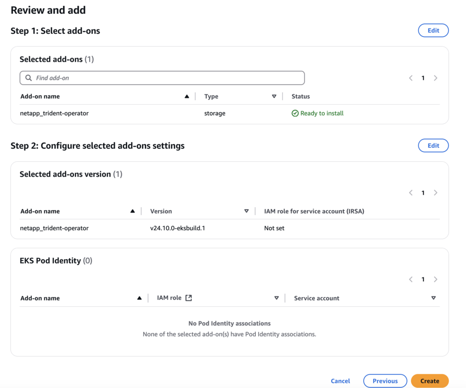

= EKS クラスター上の Trident EKS アドオンを設定する
:hardbreaks:
:allow-uri-read: 
:icons: font
:imagesdir: ../media/

[role="lead"]
NetApp Tridentは、Amazon FSx for NetApp ONTAPのKubernetesストレージ管理を合理化し、開発者と管理者がアプリケーションの導入に集中できるようにします。NetApp Trident EKSアドオンには、最新のセキュリティパッチとバグ修正が含まれており、Amazon EKSで動作することがAWSによって検証されています。EKSアドオンを使用すると、Amazon EKSクラスターの安全性と安定性を常に確保し、アドオンのインストール、設定、更新に必要な作業量を削減できます。

== 前提条件

AWS EKS の Trident アドオンを設定する前に、以下のものを用意してください：

* アドオンを操作する権限を持つ Amazon EKS クラスターアカウント。link:https://docs.aws.amazon.com/eks/latest/userguide/eks-add-ons.html["Amazon EKS アドオン"^]を参照してください。
* AWS マーケットプレイスへの AWS 権限：
`"aws-marketplace:ViewSubscriptions",
"aws-marketplace:Subscribe",
"aws-marketplace:Unsubscribe`
* AMI タイプ：Amazon Linux 2（AL2_x86_64）または Amazon Linux 2 Arm（AL2_ARM_64）
* ノードタイプ：AMDまたはARM
* 既存の Amazon FSx for NetApp ONTAP ファイルシステム

== 手順

. EKS ポッドが AWS リソースにアクセスできるようにするには、IAM ロールと AWS シークレットを作成してください。手順については、link:../trident-use/trident-fsx-iam-role.html["IAMロールとAWSシークレットを作成する"^]を参照してください。
. EKS Kubernetes クラスターで、 * アドオン * タブに移動します。
+
image::../media/aws-eks-01.png[aws eks 01]

. *AWS Marketplace アドオン* に移動し、_storage_ カテゴリを選択します。
+
image::../media/aws-eks-02.png[aws eks 02]

. *NetApp Trident* を見つけて、Trident アドオンのチェックボックスをオンにし、*次へ* をクリックします。
. アドオンの目的のバージョンを選択します。
+
image::../media/aws-eks-03.png[aws eks 03]

. 必要なアドオン設定を構成します。
+

. IRSA（サービスアカウントのIAMロール）を使用している場合は、追加の構成手順を参照してくださいlink:https://docs.netapp.com/us-en/trident/trident-use/trident-fsx-install-trident.html#enable-the-trident-add-on-for-aws["ここをクリックしてください。"]。
. *Create*を選択します。
. アドオンのステータスが _Active_ であることを確認します。
+
image::../media/aws-eks-05.png[aws eks 05]

. 次のコマンドを実行して、Trident がクラスタに正しくインストールされていることを確認します：
+
[listing]
----
kubectl get pods -n trident
----
. セットアップを続行し、ストレージ バックエンドを構成します。詳細については、link:../trident-use/trident-fsx-storage-backend.html["ストレージバックエンドを設定する"^]を参照してください。

== CLI を使用した Trident EKS アドオンのインストール / アンインストール

.CLI を使用して NetApp Trident EKS アドオンをインストールします：
次のコマンド例では、Trident EKS アドオンをインストールします：
`eksctl create addon --cluster clusterName --name netapp_trident-operator --version v25.6.0-eksbuild.1`（専用バージョンを使用）

以下のコマンド例は Trident EKS アドオンバージョン 25.6.1 をインストールします：
`eksctl create addon --cluster clusterName --name netapp_trident-operator --version v25.6.1-eksbuild.1`（専用バージョンを使用）

以下のコマンド例は Trident EKS アドオンバージョン 25.6.2 をインストールします：
`eksctl create addon --cluster clusterName --name netapp_trident-operator --version v25.6.2-eksbuild.1`（専用バージョンを使用）

.CLI を使用して NetApp Trident EKS アドオンをアンインストールします：
次のコマンドは、Trident EKS アドオンをアンインストールします：

[listing]
----
eksctl delete addon --cluster K8s-arm --name netapp_trident-operator
----